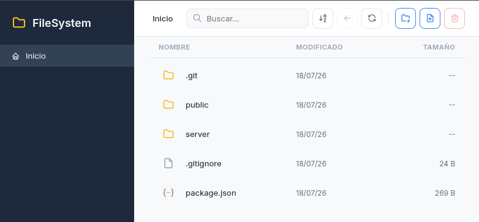

# FileSystem

Explorador de archivos web construido como ejercicio de [Eloquent JavaScript](https://eloquentjavascript.net/). Permite navegar, crear, eliminar y ver detalles de archivos y carpetas desde el navegador.



## Requisitos

- Node.js >= 18

## Inicio rápido

```bash
npm install
npm start
```

Abre http://localhost:3000 en tu navegador.

## Comandos

| Comando | Descripción |
|---------|-------------|
| `npm start` | Inicia el servidor |
| `npm run dev` | Inicia con auto-reload (usa `--watch`) |

## Variables de entorno

| Variable | Default | Descripción |
|----------|---------|-------------|
| `PORT` | `3000` | Puerto del servidor |
| `BASE_DIR` | Directorio actual | Ruta raíz a explorar |

```bash
# Explorar una carpeta específica
BASE_DIR=~/Documents npm start

# Puerto personalizado
PORT=8080 npm start
```

## Funcionalidades

- Navegación por carpetas (doble clic)
- Botón de retroceso con historial
- Crear archivos y carpetas
- Eliminar archivos y carpetas
- Búsqueda en tiempo real
- Ordenar por nombre
- Detalles de archivos (click derecho > Ver detalles)
- Atajos de teclado: `Backspace` (volver), `Delete` (eliminar), `F5` (refrescar)

## Arquitectura

```
server/index.mjs          Servidor HTTP puro (Node.js, sin dependencias)
public/
  index.html              HTML
  style.css               Estilos
  js/
    app.mjs               Entry point y orquestación
    api.mjs               Cliente HTTP para la API
    state.mjs             Estado y navegación
    view.mjs              Renderizado de lista
    components.mjs        Modales y context menu
    utils.mjs             Utilidades (fechas, tamaño, iconos)
```

**Backend:** Node.js con `node:http` (cero dependencias externas)  
**Frontend:** JavaScript vanilla con módulos ES  
**Iconos:** [Tabler Icons](https://tabler.io/icons) vía CDN  
**Fuente:** [Inter](https://fonts.google.com/specimen/Inter) vía Google Fonts
